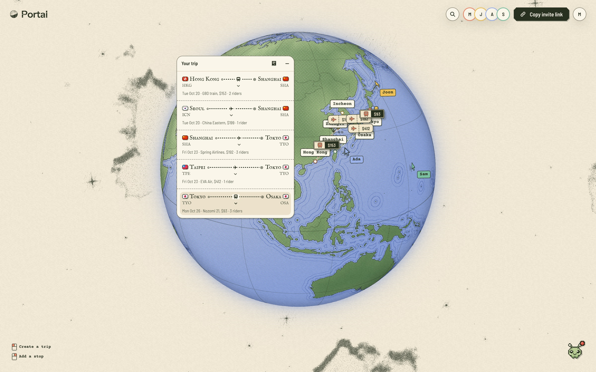

# Portal

**Draw a trip on a globe with your friends, and Portal works out how everyone gets there.**

Click to take off, fly the paper plane, click to land. Friends join from wherever they're starting, and the trip
comes together live on one shared globe, along with the trains, flights and buses to get you all there and who owes
what.



Built at the HKU Hackathon, Fall 2026.

## Run it

You need Node 22.18 or newer and pnpm.

```sh
pnpm install
cp .env.example .env.local   # then fill in what you have; see below
pnpm dev                     # http://localhost:3000
```

Want a shared trip without any keys? `pnpm dev:party` starts a local Liveblocks server (it needs
[Bun](https://bun.sh)) and seeds a four-person trip at http://localhost:3000/t/partyTestRoom001. Open it in a few
browser profiles and join as a guest in each.

| Command | What it does |
|---|---|
| `pnpm dev` | Generates design tokens and starts the dev server |
| `pnpm dev:party` | The same, against a local Liveblocks server with a seeded trip |
| `pnpm test` | Unit tests (Vitest) |
| `pnpm lint` | ESLint |
| `pnpm build` | Production build |

## Environment

Everything goes in `.env.local`. `.env.example` lists every variable, with where to get each one. The globe and
search work with none of them; without a provider's key, its fares fall back to estimates, labelled as estimated.

| Variable | For |
|---|---|
| `LIVEBLOCKS_SECRET_KEY` | Shared trips. Required for `/t/<id>`, unless you use `pnpm dev:party` |
| `NEXT_PUBLIC_SUPABASE_URL`, `NEXT_PUBLIC_SUPABASE_PUBLISHABLE_KEY`, `SUPABASE_SECRET_KEY` | Accounts and saved trips. Without them everyone is a guest |
| `DEEPSEEK_API_KEY` | Pip, the trip's agent |
| `DUFFEL_ACCESS_TOKEN` | Live flight fares and in-app booking. A test token books Duffel's sandbox airline |
| `TRAVELPAYOUTS_TOKEN`, `TRAVELPAYOUTS_MARKER` | Cached flight fares with affiliate links |
| `LITEAPI_API_KEY` | Real hotels and photos. A free sandbox key is enough |
| `STRIPE_SECRET_KEY`, `STRIPE_PUBLISHABLE_KEY`, `STRIPE_WEBHOOK_SECRET` | Paying for a booked seat. Use test keys |
| `BOOKING_ENCRYPTION_KEY` | Seals saved traveller details (`openssl rand -base64 32`). Required with `SUPABASE_SECRET_KEY` |

Rail, bus and ferry sources for Taiwan, Korea, Singapore and Malaysia have their own optional keys, listed in
`.env.example` and in [the transport docs](docs/transport/README.md).

## Find your way around

- [`docs/transport`](docs/transport/README.md): how a click on the globe becomes a list of real routes
- [`docs/trip`](docs/trip/README.md): the shared plan, who sleeps where, and the cost split
- [`docs/booking`](docs/booking/README.md): buying a seat from inside the app
- [`DESIGN.md`](DESIGN.md): the Paper Atlas design system, browsable at `/design`

This is Next.js 16, which differs from older versions; `AGENTS.md` has the notes for working on it.

## Licence

Portal is source-available under the [PolyForm Noncommercial License 1.0.0](LICENSE.md). You may read, run, change and
share the code for noncommercial purposes: personal study, research, hobby projects, and use by charities, schools and
public bodies. Any commercial use, including running Portal or a product built on it as a business, needs a separate
paid licence from the authors. Ask through [GitHub](https://github.com/stanley-910/portal/issues).

Bundled data keeps its own licence and is not covered by ours: OurAirports and Natural Earth are public domain,
Wikidata is CC0, OpenStreetMap-derived hub data is © OpenStreetMap contributors under the ODbL 1.0, and the Passport
Index dataset is credited to passportindex.org (see `src/lib/transport/hubs/DATA.md` and `data/entry/`). Dependencies
keep their own licences.
