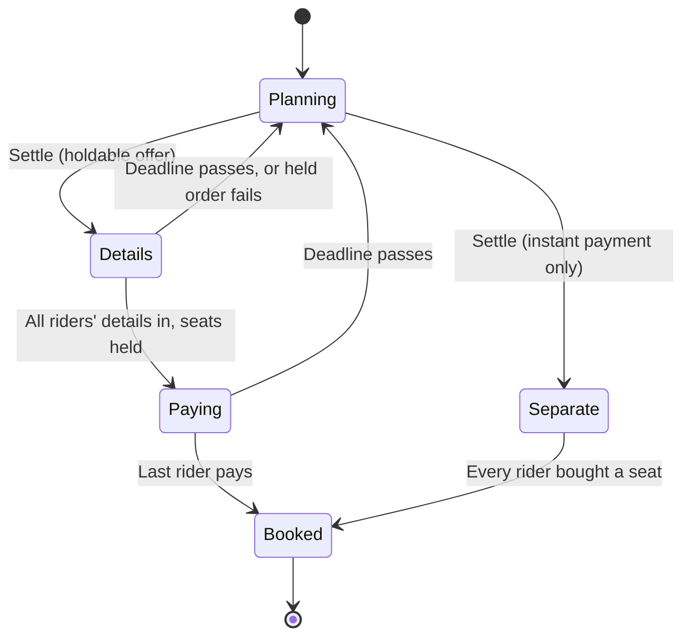

# Booking a leg

How the members of a trip buy their tickets for a leg, each paying their own share. Flights only, through Duffel and
Stripe. The flow below is built (see "What's built" at the end); Pip staging and hotels are not.

## The idea

A shared leg is booked all or nothing. Each rider checks out their own seat, and the tickets are only bought once every
rider has paid. Until then, money is held on their cards, not taken. If the deadline passes first, every hold is
released, nobody pays, and the leg goes back to planning.

This keeps the app's promise of showing what each person owes: each rider pays exactly their share, and nobody ends up
with a ticket for a flight the rest of the group missed.

When the airline won't hold seats, the leg falls back to **separate tickets**: each rider buys their own seat straight
away, with a warning that the price can change and seats aren't reserved.

## Lifecycle of a leg's booking



1. **Planning.** Today's leg: options, votes, a chosen offer.
2. **Settle.** A rider presses Settle on a leg whose chosen offer came from Duffel. The server searches again for that
   flight with one passenger per rider and matches it by flight numbers and departure time. A price more than 2% above
   what the leg showed comes back for everyone to see before going on; a lower one just goes through. If Duffel no longer
   has the offer, the flights the leg kept with it (numbers, airports, departure) are searched for instead. Riders, the
   date and the chosen option lock.
3. **Details.** Each rider enters their own traveller details: name, date of birth, gender, email, phone, and a
   passport only when the offer asks for one (`passenger_identity_documents_required`). Duffel needs every passenger's
   details to hold seats, so this comes before payment. When the last rider's details are in, the server creates a
   Duffel **hold** order. That fixes the seats and, for a while, the price.
4. **Paying.** Each rider checks out their share with Stripe as a card hold (`capture_method: manual`). The leg shows
   "2 of 4 paid · 31 h left".
5. **Booked.** The last hold triggers the purchase: get the order's latest price, pay Duffel from our balance
   (`POST /air/payments`), then capture each rider's card for their share. Tickets go to each rider's email.
6. **Deadline missed.** Cancel the hold order (refund is always 0 for an unpaid hold), cancel every card hold, and put the
   leg back in Planning for everyone. Riders who paid get a message saying their card wasn't charged.

### The deadline

The deadline is the earliest of these, minus one hour of margin:

- `price_guarantee_expires_at` on the held order: after it, the price can rise, and a card hold can't be captured for
  more than was held.
- `payment_required_by` on the held order: after it, the airline releases the seats.
- The earliest `capture_before` among the riders' card holds. Online card holds usually last 7 days, so this rarely binds.

On Duffel's test airline that is 48 hours from settling. Real airlines vary, and many low-cost ones don't hold at all.
The leg always shows the deadline; Pip can remind riders who haven't paid.

### Shares

Each rider's share is the order total divided by the riders, rounded to the cent, with the remainder on the rider who
settled. The cost split uses this paid price for a booked leg instead of the chosen offer's quote.

If the price at payment time is lower than what was held, capture the lower amount; Stripe releases the rest. If it's
higher (only possible past the price guarantee), don't buy: tell the group and ask each rider to approve the
difference with a new hold.

## Separate tickets

For an offer that requires instant payment. Each rider presses Buy my seat, enters their details, pays, and the server
immediately searches again for one seat on that flight and creates a one-passenger Duffel order. The leg shows who has a
ticket. If a later rider's price is higher or the flight is full, they see it before paying and the group decides
whether to switch flights.

## Where Book starts

- **In a trip.** Options from Duffel carry a Bookable badge. A leg whose pick is one shows Settle and book to its
  riders. Any other pick is bought on its provider's site, by each rider: the leg links to it ("Book on 12Go").
- **On the home globe.** Booking needs a trip, so a Bookable pick on the ticket adds Book under Save. It saves the
  trip like Save trip, then opens it at `/t/<id>?book=<leg>` with that leg's Settle in view and focused. The saved leg
  keeps its pick and is ridden by the saver, so nothing is searched again. Guests sign in first and carry on after.

## Who can do what

- **Any rider can check out their own seat, guests included.** Guests give an email at checkout; it's where their
  ticket and booking link go. A rider can't pay for someone else's seat.
- **Settling** needs a rider. Any rider can also undo a settle while nobody has paid yet.
- **Pip stages, people pay.** Pip can settle a leg when asked, prefill details a member saved, show who still owes and
  remind them. It can't place card holds or complete payments. Pip completing a checkout within a limit the user sets
  comes later, enforced on the server, never by the prompt.

## Where data lives

Trip room Storage is visible to every member, so it carries status only. Nothing personal goes there.

Each leg carries `booking` (`LegBooking` in `src/lib/liveblocks/types.ts`): mode, status, the settled offer and its
route, the hold order id, the deadline, the total, one seat per rider (share, details in, paid, and for separate
tickets that rider's order and reference), the airline reference, and who settled when. A leg also carries
`bookingNotice`: why the last booking stopped, shown until someone dismisses it. While a leg has a booking, its date,
riders, pick and removal are locked, for members and for Pip.

Server-only, in Supabase (`supabase/migrations/0002_booking.sql`, read with `SUPABASE_SECRET_KEY`; RLS is on with no
policies, so nothing else can read it):

- **Traveller details** until the order is created, sealed with AES-256-GCM under `BOOKING_ENCRYPTION_KEY`, then
  deleted. Passports especially never outlive the order.
- **Payments**: one row per rider per leg with the Stripe session and PaymentIntent ids, amount, status, when the
  card hold lapses and, for separate tickets, the offer the seat was priced against. This is what the server trusts,
  not Storage.
- **Leases**: short locks so the purchase runs once when a webhook and a return visit race.

Without `SUPABASE_SECRET_KEY` all three live in the server's memory and a restart loses them; a rider whose details
were lost is asked for them again. Fine for one dev server, not for a deploy.

Only the server writes `booking`: clients can't mark themselves paid.

## Server pieces

- `src/lib/booking/flow.ts` is the flow; only it writes `booking`. `duffel.ts` and `stripe.ts` are the two clients
  over plain fetch, `store.ts` the Supabase or memory store, `shares.ts` the arithmetic, `offer.ts` how a fresh
  search is matched to the chosen flight (flight numbers, airports and departure minute).
- `src/lib/booking/ready.ts`: whether a leg can be settled (a rider, a live Duffel pick, not settled yet), and the
  flights a stored pick was for. Pure, so the flow, the panel and Pip agree.
- `src/app/t/booking-actions.ts`: the server actions the plan panel calls (settle, cancel settle, submit details,
  pay share, dismiss notice). Each checks the caller is a member of the room first.
- **Stripe**: Checkout Sessions with `payment_intent_data[capture_method]=manual`. `/api/booking/return` is where
  Checkout sends the rider back; it confirms the hold with Stripe and returns them to the trip. `/api/booking/stripe`
  is the webhook (`checkout.session.completed`, `payment_intent.canceled`), verified by hand against
  `STRIPE_WEBHOOK_SECRET`. Either path marks the seat; the purchase runs under a lease and asks Duffel whether the
  order is already paid, so a retry can't buy twice.
- **Expiry**: `expireBookings` runs after a trip page renders and before every booking action. Rooms nobody opens are covered by the scheduled sweep: `vercel.json` runs `/api/booking/expire` once a day (the Hobby plan allows no more; on Pro, every ten minutes is the right cadence), which calls `sweepBookings` over every leg in the store's active list (`booking_active`, kept in step by the flow whenever a leg is settled, booked or rolled back). Vercel authenticates the call with `CRON_SECRET`; without it the route refuses everything. Locally: `curl -H "Authorization: Bearer $CRON_SECRET" localhost:3000/api/booking/expire`.
- **Duffel webhook** for schedule changes and airline cancellations on booked legs: still to do.
- Duffel balance: we pay Duffel from a prepaid balance and collect from riders through Stripe. Keep enough in it for
  the largest group order we expect, and set Duffel's low-balance alert.

Offers expire about half an hour after a search, and Duffel then refuses them by id (`offer_no_longer_available`). So
the booking keeps the settled flights (numbers, airports, departure), and they're searched for again (one seat per
rider) whenever the offer is needed later: when the hold is placed, and when a separate seat is bought. A higher price at
that point stops the step and says so; a lower one is used.

## Failure handling

| What happens | What the riders see |
| --- | --- |
| Re-search can't find the chosen flight at settle | "That flight is gone"; back to the options |
| Hold order fails (seats gone, price changed) | Back to Planning with the reason; details are deleted |
| The airline refuses one rider's detail (a phone number, a passport) | Only that rider enters their details again; everyone else's stay in and the settle stands |
| A card hold fails | That rider retries; others are unaffected |
| Paying Duffel fails after every card is held | Retry, then cancel every card hold and return to Planning; nobody is charged |
| A capture fails after Duffel was paid | The ticket stands; that rider's share becomes a debt in the split and we contact them. Rare, since holds are already approved. |
| Airline changes or cancels a booked flight | Duffel webhook; the leg shows it and links to the airline |

Cancelling or changing a booked ticket links to the airline at first; Duffel's order change and cancellation APIs come
later.

## Running it

Keys in `.env.local` (all optional; see `.env.example`):

| Var | Without it |
| --- | --- |
| `DUFFEL_ACCESS_TOKEN` | No Duffel offers, so nothing to settle. A test token sells Duffel's sandbox airlines: those fares are Bookable like live ones and hold every fare. They carry a `sandbox` flag but no badge. |
| `STRIPE_SECRET_KEY` | "Pay my share" is a no-charge test checkout: the seat is held at once and nobody's card is touched. Only with a Duffel test token; with a live one, paying is refused until Stripe is set. |
| `STRIPE_WEBHOOK_SECRET` | The webhook refuses everything; the return route alone confirms holds. Locally: `stripe listen --forward-to localhost:3000/api/booking/stripe --events checkout.session.completed,checkout.session.async_payment_succeeded,payment_intent.canceled`. |
| `SUPABASE_SECRET_KEY` + `BOOKING_ENCRYPTION_KEY` | Details, payments and leases stay in memory. Run `pnpm db:migrate` once the key is set. |
| `CRON_SECRET` | The scheduled sweep refuses every call, so only trip visits and booking actions expire bookings. Set this secret in the deployment configuration. |

Checkout sessions are card only (`payment_method_types: ["card"]`, a hold needs a card) and opt out of Stripe's Managed Payments, which new accounts have on by default and which refuses line items without a tax code. A fresh Stripe sandbox needs no other settings.

Rehearsal: `src/lib/booking/demo-seed.test.ts` (opt-in, `BOOKING_SEED=1`) seeds a two-rider trip on a Duffel test fare and prints its id; `node scripts/checkout-rehearsal.mjs <id>` then drives settle, details and both Stripe payments with guest cookies `portal_guest=g_demoAnn` / `portal_name=Ann`.

Stripe test cards: `4242 4242 4242 4242` authorises; `4000 0000 0000 9995` is declined.

Testing:

- `pnpm test` covers the arithmetic, the offer matching, the traveller validation, the Stripe signature check, the
  sealing of traveller details, and that a leg saved from the home globe arrives ready to settle.
- Duffel test mode plus the test checkout run the whole flow without money. `src/lib/booking/live.test.ts` does it
  against a real room and is opt-in, since it makes rooms and test-mode orders:

  ```sh
  BOOKING_LIVE=1 node --env-file=.env.local node_modules/vitest/vitest.mjs run src/lib/booking/live.test.ts
  ```

  It settles two riders on a Duffel Airways HKG → PVG fare, enters both riders' details, holds the order, pays both
  shares, buys, and checks the reference; then buys one separate seat with an instant order, lets a deadline pass and
  checks the leg is back in planning with its notice, settles again and cancels.

## What's built, and what isn't

Built: settle with the price check, traveller details, the hold order, card holds through Stripe Checkout or the test
checkout, the purchase and capture, separate tickets, the deadline and expiry, cancel settle, the lock on a settled leg,
the settled share in the cost split, and Pip seeing who still owes.

Not yet:

1. **Pip staging.** Settle on request and reminders. Pip already reads the booking from the plan.
2. **Duffel's order webhook** for schedule changes and cancellations.
3. **Changing or cancelling a booked ticket** from the app.
4. **Hotels.** The same group checkout for stays, once Duffel enables Stays on our account.

## Open questions

- Which points of sale Duffel sells from, and whether live mode allows holds for the airlines on the demo routes.
- Whether the purchase should wait for a group vote before settling, or whether any rider may settle.
- Refund policy when the airline cancels a booked leg.

## References

- [Duffel: holding orders and paying later](https://duffel.com/docs/guides/holding-orders-and-paying-later)
- [Duffel: payments](https://duffel.com/docs/api/payments/create-payment)
- [Duffel: order cancellations](https://duffel.com/docs/api/order-cancellations)
- [Duffel: orders](https://duffel.com/docs/api/orders)
- [Stripe: place a hold on a payment method](https://docs.stripe.com/payments/place-a-hold-on-a-payment-method)
- [Stripe: extended authorization](https://docs.stripe.com/payments/extended-authorization)
