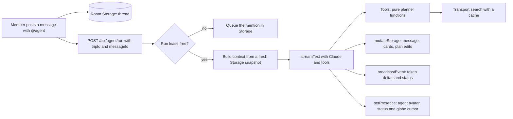

# Agent harness (draft)

Status: draft for discussion, 2026-10-03. Nothing here is built. It fills in M15 and M16 in [decisions.md](decisions.md) and answers its open question about simultaneous @mentions. Once we agree on it, the decisions move into `decisions.md` as M18 onwards.

## What the agent is for

The agent works out how to get between places, and it is good at the searches people find tedious by hand:

- **Date and price scans:** "cheapest weekend in November from HK to Tokyo", or "fly out any time from the 3rd to the 7th, back within 5 days".
- **Meet-up search:** "Seoul and HK: where should we meet, and when?"
- **Trade-offs:** "the train is 3 hours slower but HKD 400 cheaper; here is the Pareto set".
- **Plan edits:** adding stops and legs, setting riders and running searches, so the change appears live on everyone's globe.

It does not plan itineraries, suggest sights or write reviews (AGENTS.md scope). It cannot vote, choose an option or pay (M16).

Solo planners and parties use the same harness. A solo trip is a room with one member. The only difference is that "who" arguments default to that one member.

## Shape



- **Runtime:** a Node route handler using the Vercel AI SDK's `streamText` with the DeepSeek provider: `deepseek-flash`, which points to DeepSeek V4.1 Flash (decided 2026-10-03). The SDK and Next versions must be checked against `node_modules` before any code is written (AGENTS.md).
- **Trigger:** the client writes the message to Storage, then calls the run route. The server reads the message back from Storage, so it never trusts the request body for content.
- **Streaming:** token deltas go out through `broadcastEvent`, which is cheap and not persisted. The finished message and its cards are written to Storage once at the end, and once at each tool boundary. That keeps us inside the free-tier write limits.
- **Presence:** the agent appears in the avatar stack with a status ("searching HKG → NRT, 12 dates"). Its globe cursor moves to the place it is working on. This costs very little and makes the agent visible on the globe during the demo.

## One run per room at a time

This answers the open question in decisions.md about two people @mentioning the agent at once.

- `agent: { runId, status, leaseUntil, queue: messageId[] }` lives in Storage.
- A run takes the lease using `mutateStorage`, and renews it at every step.
- A mention that arrives during a run is appended to the queue. When the run finishes, it drains the queue as one follow-up turn, so the agent answers both people together instead of racing.
- A Stop button sets `status: "cancelling"`. The run checks this between steps and aborts through its `AbortSignal`.
- If a lease expires because a function died, the next mention takes the lease over.

## Context: rebuilt every turn, never trusted from history

The system prompt has a static part plus a per-turn block built from a fresh Storage snapshot:

- Today's date and the trip's dates.
- Members, using short handles (`M1 Stanley · origin HKG · on legs L1 L3`).
- Stops (`S1 Hong Kong West Kowloon`) and legs with riders, date, chosen option and search status.
- Soft locks: who is editing what (M11).
- The message that triggered the run, and who sent it.

Thread history is included as plain text, limited to the last N messages. Tool payloads from earlier turns are not replayed. If the agent needs a fact, it reads it again with a tool. Plan state always comes from the snapshot, never from what the agent said earlier.

## Tools

Each tool is a thin wrapper around a pure function in `src/lib/planner/`, and that function is unit-tested on its own. The heavy work happens inside tools, so the model never has to call search 40 times or do sums.

| Tool | Kind | What it does |
|---|---|---|
| `get_trip` | read | The compact snapshot above, in case it changed during the run |
| `find_places` | read | Free text or lat/lng to bundled hubs (`nearbyHubs`), with no geocoding |
| `search_leg` | search | One origin and destination on one date. Returns the top K lean options |
| `scan_dates` | optimize | A date range or a set of weekdays plus a trip-length window. Returns a price-by-day strip and the best 3 date pairs |
| `find_meetup` | optimize | Origins per member with time windows, candidate cities (optional) and an objective. Returns ranked cities with each person's legs |
| `rank_options` | optimize | The Pareto set over price, duration and transfers for a leg's options, with a short note on each trade-off |
| `price_party` | compute | The cost split by who is present for each leg and night (POR-37), fed by the planner instead of the model |
| `edit_plan` | write | A list of operations: add a stop, add a leg, set riders, set a date, run a search. Applied in one `mutateStorage` |

### How results are shaped

- **Handles, not payloads:** options come back as `O7` with price, duration, transfers, mode, carrier and `kind`. Full detail stays in Storage or the search cache. A list says `+14 more` instead of including them.
- **Money:** integer minor units plus a currency, converted in the tool. The prompt says to quote numbers exactly as the tool gave them and never to recompute them.
- **Freshness:** each option carries `kind` (`live`, `cached`, `timetable` or `estimated`), and the tool's summary line counts estimates ("3 of 8 prices are estimated").
- **Two views:** a tool returns `{ forModel, card }`. The model sees the lean summary. The card (date strip, meet-up table, option list) is written to the thread message and rendered by React components. That is how "estimated" badges are guaranteed: they come from the card data, not from the model's prose.
- **Refusals the model can recover from:** `{ refused: code, reason, next }`. Examples: `LEG_LOCKED` ("Ana is editing L2. Ask, or wait."), `STALE` ("L2 changed since you read it. Call get_trip."), `OUT_OF_COVERAGE` ("no hubs within 150 km").

### Writes

`edit_plan` applies the change directly, as M15 says, and does not ask for a confirmation first. Each run's edits are recorded as one changeset in Storage, and its card has an Undo button. Undo is a server action that does not go through the model.

- **Guards:** every operation carries the leg version it read, so a leg someone edited since is refused with `STALE`. Locked legs are refused. Votes, picks and payment are not in the tool schema at all.
- **Why direct edits and not proposals:** in a live room, a proposal card that waits for a click adds friction. People can already see every edit on the globe, and Undo makes a mistake cheap.

## The optimisation engine (the actual work)

Both optimisers run in two phases, so they stay within a call budget:

1. **Prune with cheap estimates.** Use bundled hub connections, distance and the F03 flight estimate (40 min + distance at 780 km/h; USD 40 + 0.075 × km), plus seeded train and bus timetables. This scores every candidate with no network calls.
2. **Run real searches on the top K only,** through a shared search cache keyed by `(hubFrom, hubTo, date, mode)`. Each run has a provider-call budget of about 60 calls and at most 6 concurrent calls, and each provider keeps the existing 8 s deadline.

**`scan_dates`:** for flights, a month-level Travelpayouts call can probably return a whole calendar in one request (this needs checking against `docs/transport/api`). Seeded trains and buses are mostly the same every day, so scanning their dates costs nothing.

**`find_meetup`:**
- **Candidates:** hubs that every origin can reach with at most one transfer.
- **Score for each candidate:** total cost, the longest single journey, the spread between arrival times and fairness (the largest cost minus the smallest). The objective sets the weights: `cheapest`, `fairest`, `soonest_together` or `balanced`.
- **Result:** the top 5 cities, each with its per-person legs and dates, and a card that can draw the candidate routes on the globe.

Both optimisers feed Pareto ranking (POR-25) and the meet-up solver (POR-26). They are one module that the UI can use too, not something only the agent has.

## Limits and failure modes

- **Run limits:** at most 10 steps, 90 s of wall-clock time per run (`maxDuration`), and the provider-call budget above.
- **Provider failures:** a failure degrades to an estimate with `kind: "estimated"`, never to an error (the mock-fallback rule).
- **Model errors:** the run writes a short failure message and releases the lease.
- **Logging:** each step logs tokens and cache hits, but no message content.

## Testing

- **Unit tests** on the planner functions with the existing mocks and seeds. This is where the real correctness lives: scan results, meet-up ranking and the cost split.
- **Tool contract tests:** tool output shape, refusals, and that no retired tool name appears in a prompt or description.
- **Scripted runs** with the AI SDK's mock language model, covering the lease, the queue, cancelling and `STALE` handling.
- **A few real-model scenarios** on the demo trip fixture: "cheapest Nov weekend HK→Tokyo", "where should Seoul and HK meet on the 14th?", "Mei leaves after Shanghai: update the split". The checks are on Storage state and tool calls, not on the wording.

## What we take from earlier harness work, and what we leave out

**Kept as patterns:**
- Tools are thin wrappers over tested functions.
- Results are lean, with handles.
- Refusals name the next step.
- Context is re-read every turn instead of trusted from history.
- Arithmetic happens in tools.
- The model's view and the UI's card are separate.
- Card buttons bypass the model.

**Left out:**
- A versioned plan store and confirming an exact plan version, because no money moves through the agent here.
- A separate database, because Storage is the store (M5).
- Budget ledgers.

## Open questions

1. ~~Direct edits or proposals?~~ Settled on 2026-10-03: direct edits, with Undo for each run's changeset.
2. Should the optimisers be callable by the UI without the agent (a "find cheapest dates" button), or only through chat? Recommended: both, because the logic is in one module either way.
3. ~~Which model?~~ Settled on 2026-10-03: DeepSeek V4.1 Flash (`deepseek-flash`).
4. Is a `mutateStorage` write at each tool boundary within the free-tier limits during a 4-person demo? This needs checking against [free-tiers.md](free-tiers.md).

## Grilling log, 2026-10-03

Decisions from the grilling session on tools and use cases. They take precedence over the earlier sections of this draft where the two disagree.

**G1. First use cases.** All of these:
- Plan from a sentence.
- Meet-up finder.
- Cheapest-date scan.
- Leaving early and re-splitting costs.
- Whole-route optimisation: moving dates, modes or intermediate stops across several legs to reach a target set by one member or by the group.

The date scan and the meet-up finder are special cases of route optimisation. They share one engine in `src/lib/planner/`, and the model gets narrow tools on top of it.

**G2. Targets are caps plus one objective.**
- **Caps:** hard limits per member or for the group, on price or hours.
- **Anchors:** fixed points, for example "be at S3 by 20 Nov".
- **Freedoms:** what the optimiser may change: date shift, allowed modes, and swapping a stop within a radius.
- **Objective:** one metric to minimise (price, duration or transfers). There is no weighted score.

When the caps can't be met, the result gives the closest miss and says which cap or anchor to relax, and by how much.

**G3. `optimize_route` is read-only.**
- It returns 1 to 3 candidates (P1, P2 and so on). Each candidate has:
  - a diff against the current plan
  - per-member totals
  - the change compared with the current plan
  - the caps that are tight
  - a count of estimated prices
- `apply_plan(P1)` writes a candidate as one changeset that can be undone. A card's Apply button does the same without going through the model.
- The agent applies straight away only when the request was a command and one candidate clearly wins. Otherwise it shows the options.

**G4. Estimates are used for pruning, never for the final answer.** Every leg in a candidate is searched again with real providers, through the cache, before it is shown. A saving that still depends on an estimated price is labelled "estimated saving".

**G5. `edit_plan` resolves places itself.**
- An operation takes `{ stop: "S2" }`, `{ hub: "…" }` or `{ place: "free text" }`.
- The text is matched against bundled hubs. A match near an existing stop snaps onto that stop (M8).
- A stop is a place, and each search picks the hubs for each mode, so a city name is not ambiguous. `AMBIGUOUS_PLACE`, which returns ranked choices, is only for names that match different places.

**G6. Stay costs are entered by members.**
- Each stop has an optional shared cost per night. A member types it in, or the agent sets it from a sentence.
- How many nights each member stays comes from the legs they ride.
- When no cost is entered, the split covers transport only and says so.
- There is no hotel search or estimated nightly rate, because that is out of scope.

**G7. Member caps are stored as member preferences.**
- These are kept on the member in Storage: budget cap, earliest departure, latest return and home stop. They show on the member's avatar card.
- Every run respects them, and a single request can override them for that run.
- Room Storage is visible to the whole party, so budgets are not private.

**G8. "Minimise price" means the group total by default.**
- Fairness comes from member caps, and each card always shows every person's share.
- "Fairest" in a request switches the objective to the worst-off member.
- Every tool uses the same default.

**G9. What gets built for the demo on 4 October.** Everything else in this doc is the roadmap.
- **The thread and the run route:** one run at a time. A mention that arrives during a run gets "busy, try again" instead of joining a queue.
- **Tools:** `get_trip`, `edit_plan` with Undo, and `find_meetup`. `find_meetup` runs on the shared engine: it prunes with estimates, then searches the top 3 candidates again.
- **What chat drives:** demo steps 1 to 3.
- **Done in the UI instead:** leaving early and re-splitting costs (POR-37).
- **Not in the demo:** `scan_dates` and `optimize_route`.

### Tool shapes for the demo

Handles are `M*` for members, `S*` for stops, `L*` for legs and `P*` for candidates. They are assigned per snapshot and resolved by the server, so the model never sees a Liveblocks id. Money is in integer minor units with a currency.

`get_trip()` returns the turn's snapshot as compact text:

```
Trip "Shanghai then Tokyo" · today 2026-10-03 · currency HKD
M1 Stanley (you) · home S1 · cap 3,000
M2 Ana · home S1
M3 Joon · home S4
S1 Hong Kong West Kowloon · S2 Shanghai · S4 Seoul
L1 S1→S2 14 Nov · M1 M2 · train · 8 options, chosen none · Ana editing
```

`edit_plan({ ops })` applies all its operations in one `mutateStorage`. It returns `{ changesetId, applied, refused[] }` and a card with an Undo button.

| op | fields |
|---|---|
| `add_leg` | `from`, `to` (each a stop, hub or place), `date`, `riders[]`, `modes?`. Runs a search automatically |
| `set_date` | `leg`, `date`. Resets the leg's search (M12) and runs it again |
| `set_riders` | `leg`, `riders[]` |
| `remove_leg` | `leg` |
| `set_member_prefs` | `member`, `{ capPrice?, earliestDepart?, latestReturn?, home? }` |
| `set_stay_cost` | `stop`, `perNight` |

Refusals are `AMBIGUOUS_PLACE`, `OUT_OF_COVERAGE`, `LEG_LOCKED` and `STALE`. Each one has a `next` hint. Operations that are not refused still apply.

`find_meetup` takes origins from members' home stops unless the call gives them:

```
find_meetup({
  members?: ["M1","M2","M3"],
  around: "2026-11-14", flexDays?: 1,
  minimize?: "price" | "duration",   // over the group total (G8)
  fairest?: false,
  candidates?: [place…]              // optional shortlist
})
→ {
  candidates: [{
    id: "P1", stop: "Shanghai", date: "2026-11-14",
    perMember: { M1: { leg: "train 4h39 · 860", kind: "timetable" }, … },
    total: 2310, worstMember: "M3", arrivalSpreadMin: 95,
    estimated: 0
  }, …up to 3],
  pruned: 41
}
```

`apply_plan("P1")` adds the meeting stop and one leg for each origin group, with that group's members as riders. Like `edit_plan`, it writes one changeset that can be undone.

## Built (2026-10-03, branch `feat/agent-pip`)

| Piece | Where |
|---|---|
| The thread, the run lease and changesets in Storage | `src/lib/liveblocks/types.ts`, `src/lib/agent/types.ts` |
| Post a message and wake Pip: `POST /api/agent` (`after()`, `maxDuration` 120) | `src/app/api/agent/route.ts` |
| The run: lease, streamed text by broadcast, server presence (`activity` and a globe cursor), and a no-model fallback | `src/lib/agent/run.ts` |
| Tools: `get_trip`, `edit_plan`, `find_meetup`, `apply_meetup` | `src/lib/agent/tools.ts` |
| Snapshot handles (M1, S1, L1) | `src/lib/agent/snapshot.ts` |
| Edits with Undo, and place resolution from the bundled index | `src/lib/agent/edit.ts` |
| The meet-up engine: an offline shortlist with a hub-count discount, then real searches on the top 5 | `src/lib/agent/meetup.ts` (tests next to it) |
| Card buttons that bypass the model: Apply and Undo | `applyMeetup` and `undoAgentChange` in `src/app/t/actions.ts` |
| The UI from the Pip handoff: sprite, launcher, chat panel, cards and pixel cursor | `src/components/agent/`, tokens `pip-*` and `shadow-pixel` |

**Not built yet:**
- A run queue: a mention during a run gets "busy".
- The Stop button.
- Soft-lock refusals (`LEG_LOCKED`), because M11 isn't built.
- Member preferences (G7) and stay costs (G6).
- `scan_dates` and `optimize_route`.
- Date flexibility in `find_meetup`.
- The thread rail, pin notes and the globe shift from the handoff.

**Without a model key:**
- The model needs `DEEPSEEK_API_KEY` in `.env.local`.
- Without it, Pip answers only meet-up questions ("meet", "middle", "halfway"). It places each member where their first leg starts.
